# UML Sequence Diagrams - FlavorVerse CookBook Platform

> **Dự án**: FlavorVerse - Recipe Sharing Platform  
> **Ngày tạo**: 2025-12-06  
> **Mô tả**: Tài liệu này chứa các UML Sequence Diagram chi tiết cho tất cả các luồng nghiệp vụ chính trong hệ thống CookBookG5.

---

## 📑 Mục lục

1. [Luồng Đăng ký Người dùng](#1-luồng-đăng-ký-người-dùng)
2. [Luồng Đăng nhập Người dùng](#2-luồng-đăng-nhập-người-dùng)
3. [Luồng Tạo Công thức Nấu ăn](#3-luồng-tạo-công-thức-nấu-ăn)
4. [Luồng Xem Chi tiết Công thức](#4-luồng-xem-chi-tiết-công-thức)
5. [Luồng Đánh giá Công thức](#5-luồng-đánh-giá-công-thức)
6. [Luồng Bình luận Công thức](#6-luồng-bình-luận-công-thức)
7. [Luồng Yêu thích Công thức](#7-luồng-yêu-thích-công-thức)
8. [Luồng Theo dõi Người dùng](#8-luồng-theo-dõi-người-dùng)
9. [Luồng Xem Thông báo](#9-luồng-xem-thông-báo)
10. [Luồng Admin Phê duyệt Công thức](#10-luồng-admin-phê-duyệt-công-thức)
11. [Luồng Cập nhật Hồ sơ Người dùng](#11-luồng-cập-nhật-hồ-sơ-người-dùng)
12. [Luồng Tìm kiếm và Lọc Công thức](#12-luồng-tìm-kiếm-và-lọc-công-thức)

---

## 1. Luồng Đăng ký Người dùng

**Mô tả**: Người dùng mới đăng ký tài khoản trên hệ thống.

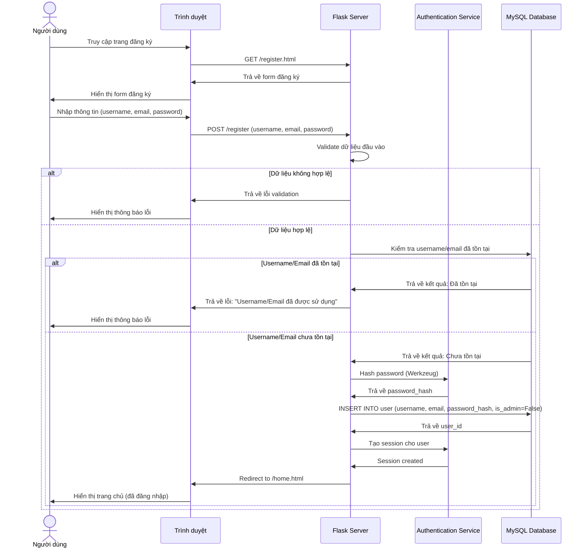
```mermaid
sequenceDiagram
    actor User as Người dùng
    participant Browser as Trình duyệt
    participant Flask as Flask Server
    participant Auth as Authentication Service
    participant DB as MySQL Database
    
    User->>Browser: Truy cập trang đăng ký
    Browser->>Flask: GET /register.html
    Flask->>Browser: Trả về form đăng ký
    Browser->>User: Hiển thị form đăng ký
    
    User->>Browser: Nhập thông tin (username, email, password)
    Browser->>Flask: POST /register (username, email, password)
    
    Flask->>Flask: Validate dữ liệu đầu vào
    
    alt Dữ liệu không hợp lệ
        Flask->>Browser: Trả về lỗi validation
        Browser->>User: Hiển thị thông báo lỗi
    else Dữ liệu hợp lệ
        Flask->>DB: Kiểm tra username/email đã tồn tại
        
        alt Username/Email đã tồn tại
            DB->>Flask: Trả về kết quả: Đã tồn tại
            Flask->>Browser: Trả về lỗi: "Username/Email đã được sử dụng"
            Browser->>User: Hiển thị thông báo lỗi
        else Username/Email chưa tồn tại
            DB->>Flask: Trả về kết quả: Chưa tồn tại
            Flask->>Auth: Hash password (Werkzeug)
            Auth->>Flask: Trả về password_hash
            
            Flask->>DB: INSERT INTO user (username, email, password_hash, is_admin=False)
            DB->>Flask: Trả về user_id
            
            Flask->>Auth: Tạo session cho user
            Auth->>Flask: Session created
            
            Flask->>Browser: Redirect to /home.html
            Browser->>User: Hiển thị trang chủ (đã đăng nhập)
        end
    end
```

**Các thành phần liên quan**:
- **Route**: `POST /register`
- **Models**: `User`
- **Database Tables**: `user`
- **Authentication**: Flask-Login, Werkzeug password hashing

---

## 2. Luồng Đăng nhập Người dùng

**Mô tả**: Người dùng đã có tài khoản đăng nhập vào hệ thống.

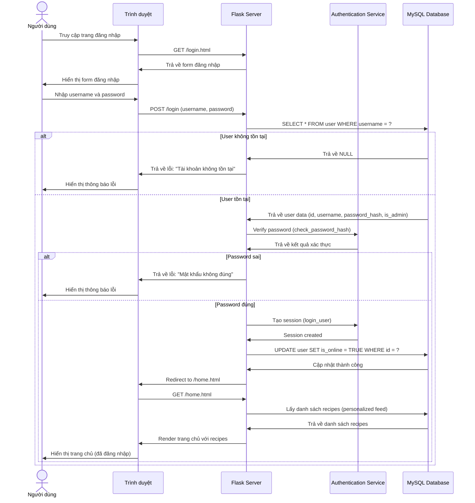
```mermaid
sequenceDiagram
    actor User as Người dùng
    participant Browser as Trình duyệt
    participant Flask as Flask Server
    participant Auth as Authentication Service
    participant DB as MySQL Database
    
    User->>Browser: Truy cập trang đăng nhập
    Browser->>Flask: GET /login.html
    Flask->>Browser: Trả về form đăng nhập
    Browser->>User: Hiển thị form đăng nhập
    
    User->>Browser: Nhập username và password
    Browser->>Flask: POST /login (username, password)
    
    Flask->>DB: SELECT * FROM user WHERE username = ?
    
    alt User không tồn tại
        DB->>Flask: Trả về NULL
        Flask->>Browser: Trả về lỗi: "Tài khoản không tồn tại"
        Browser->>User: Hiển thị thông báo lỗi
    else User tồn tại
        DB->>Flask: Trả về user data (id, username, password_hash, is_admin)
        
        Flask->>Auth: Verify password (check_password_hash)
        Auth->>Flask: Trả về kết quả xác thực
        
        alt Password sai
            Flask->>Browser: Trả về lỗi: "Mật khẩu không đúng"
            Browser->>User: Hiển thị thông báo lỗi
        else Password đúng
            Flask->>Auth: Tạo session (login_user)
            Auth->>Flask: Session created
            
            Flask->>DB: UPDATE user SET is_online = TRUE WHERE id = ?
            DB->>Flask: Cập nhật thành công
            
            Flask->>Browser: Redirect to /home.html
            Browser->>Flask: GET /home.html
            Flask->>DB: Lấy danh sách recipes (personalized feed)
            DB->>Flask: Trả về danh sách recipes
            Flask->>Browser: Render trang chủ với recipes
            Browser->>User: Hiển thị trang chủ (đã đăng nhập)
        end
    end
```

**Các thành phần liên quan**:
- **Route**: `POST /login`, `GET /home.html`
- **Models**: `User`
- **Database Tables**: `user`
- **Authentication**: Flask-Login (login_user, UserMixin)

---

## 3. Luồng Tạo Công thức Nấu ăn

**Mô tả**: Người dùng đã đăng nhập tạo công thức nấu ăn mới.

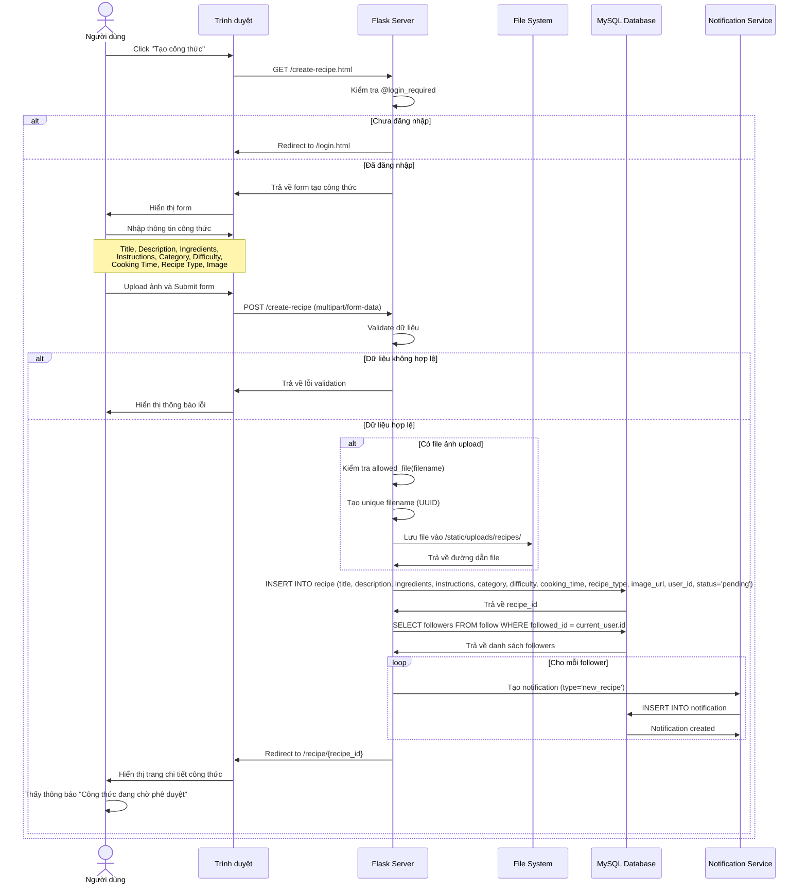
```mermaid
sequenceDiagram
    actor User as Người dùng
    participant Browser as Trình duyệt
    participant Flask as Flask Server
    participant FileSystem as File System
    participant DB as MySQL Database
    participant NotifService as Notification Service
    
    User->>Browser: Click "Tạo công thức"
    Browser->>Flask: GET /create-recipe.html
    
    Flask->>Flask: Kiểm tra @login_required
    alt Chưa đăng nhập
        Flask->>Browser: Redirect to /login.html
    else Đã đăng nhập
        Flask->>Browser: Trả về form tạo công thức
        Browser->>User: Hiển thị form
        
        User->>Browser: Nhập thông tin công thức
        Note over User,Browser: Title, Description, Ingredients,<br/>Instructions, Category, Difficulty,<br/>Cooking Time, Recipe Type, Image
        
        User->>Browser: Upload ảnh và Submit form
        Browser->>Flask: POST /create-recipe (multipart/form-data)
        
        Flask->>Flask: Validate dữ liệu
        
        alt Dữ liệu không hợp lệ
            Flask->>Browser: Trả về lỗi validation
            Browser->>User: Hiển thị thông báo lỗi
        else Dữ liệu hợp lệ
            alt Có file ảnh upload
                Flask->>Flask: Kiểm tra allowed_file(filename)
                Flask->>Flask: Tạo unique filename (UUID)
                Flask->>FileSystem: Lưu file vào /static/uploads/recipes/
                FileSystem->>Flask: Trả về đường dẫn file
            end
            
            Flask->>DB: INSERT INTO recipe (title, description, ingredients, instructions, category, difficulty, cooking_time, recipe_type, image_url, user_id, status='pending')
            DB->>Flask: Trả về recipe_id
            
            Flask->>DB: SELECT followers FROM follow WHERE followed_id = current_user.id
            DB->>Flask: Trả về danh sách followers
            
            loop Cho mỗi follower
                Flask->>NotifService: Tạo notification (type='new_recipe')
                NotifService->>DB: INSERT INTO notification
                DB->>NotifService: Notification created
            end
            
            Flask->>Browser: Redirect to /recipe/{recipe_id}
            Browser->>User: Hiển thị trang chi tiết công thức
            User->>User: Thấy thông báo "Công thức đang chờ phê duyệt"
        end
    end
```

**Các thành phần liên quan**:
- **Route**: `GET /create-recipe.html`, `POST /create-recipe`
- **Models**: `Recipe`, `User`, `Notification`
- **Database Tables**: `recipe`, `notification`, `follow`
- **File Upload**: Werkzeug secure_filename, UUID

---

## 4. Luồng Xem Chi tiết Công thức

**Mô tả**: Người dùng xem thông tin chi tiết của một công thức.

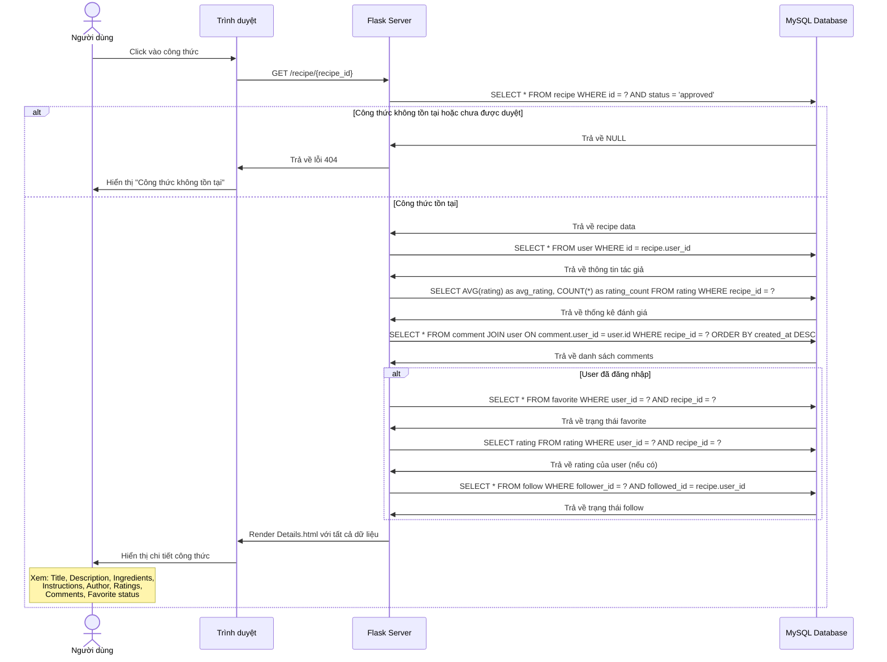
```mermaid
sequenceDiagram
    actor User as Người dùng
    participant Browser as Trình duyệt
    participant Flask as Flask Server
    participant DB as MySQL Database
    
    User->>Browser: Click vào công thức
    Browser->>Flask: GET /recipe/{recipe_id}
    
    Flask->>DB: SELECT * FROM recipe WHERE id = ? AND status = 'approved'
    
    alt Công thức không tồn tại hoặc chưa được duyệt
        DB->>Flask: Trả về NULL
        Flask->>Browser: Trả về lỗi 404
        Browser->>User: Hiển thị "Công thức không tồn tại"
    else Công thức tồn tại
        DB->>Flask: Trả về recipe data
        
        Flask->>DB: SELECT * FROM user WHERE id = recipe.user_id
        DB->>Flask: Trả về thông tin tác giả
        
        Flask->>DB: SELECT AVG(rating) as avg_rating, COUNT(*) as rating_count FROM rating WHERE recipe_id = ?
        DB->>Flask: Trả về thống kê đánh giá
        
        Flask->>DB: SELECT * FROM comment JOIN user ON comment.user_id = user.id WHERE recipe_id = ? ORDER BY created_at DESC
        DB->>Flask: Trả về danh sách comments
        
        alt User đã đăng nhập
            Flask->>DB: SELECT * FROM favorite WHERE user_id = ? AND recipe_id = ?
            DB->>Flask: Trả về trạng thái favorite
            
            Flask->>DB: SELECT rating FROM rating WHERE user_id = ? AND recipe_id = ?
            DB->>Flask: Trả về rating của user (nếu có)
            
            Flask->>DB: SELECT * FROM follow WHERE follower_id = ? AND followed_id = recipe.user_id
            DB->>Flask: Trả về trạng thái follow
        end
        
        Flask->>Browser: Render Details.html với tất cả dữ liệu
        Browser->>User: Hiển thị chi tiết công thức
        Note over User: Xem: Title, Description, Ingredients,<br/>Instructions, Author, Ratings,<br/>Comments, Favorite status
    end
```

**Các thành phần liên quan**:
- **Route**: `GET /recipe/{recipe_id}`
- **Models**: `Recipe`, `User`, `Rating`, `Comment`, `Favorite`, `Follow`
- **Database Tables**: `recipe`, `user`, `rating`, `comment`, `favorite`, `follow`

---

## 5. Luồng Đánh giá Công thức

**Mô tả**: Người dùng đánh giá công thức (1-5 sao).

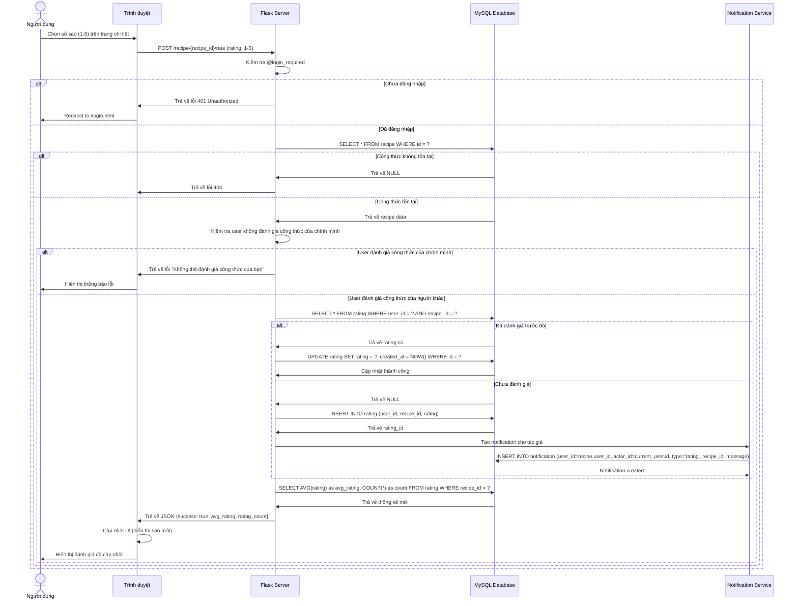
```mermaid
sequenceDiagram
    actor User as Người dùng
    participant Browser as Trình duyệt
    participant Flask as Flask Server
    participant DB as MySQL Database
    participant NotifService as Notification Service
    
    User->>Browser: Chọn số sao (1-5) trên trang chi tiết
    Browser->>Flask: POST /recipe/{recipe_id}/rate (rating: 1-5)
    
    Flask->>Flask: Kiểm tra @login_required
    
    alt Chưa đăng nhập
        Flask->>Browser: Trả về lỗi 401 Unauthorized
        Browser->>User: Redirect to /login.html
    else Đã đăng nhập
        Flask->>DB: SELECT * FROM recipe WHERE id = ?
        
        alt Công thức không tồn tại
            DB->>Flask: Trả về NULL
            Flask->>Browser: Trả về lỗi 404
        else Công thức tồn tại
            DB->>Flask: Trả về recipe data
            
            Flask->>Flask: Kiểm tra user không đánh giá công thức của chính mình
            
            alt User đánh giá công thức của chính mình
                Flask->>Browser: Trả về lỗi "Không thể đánh giá công thức của bạn"
                Browser->>User: Hiển thị thông báo lỗi
            else User đánh giá công thức của người khác
                Flask->>DB: SELECT * FROM rating WHERE user_id = ? AND recipe_id = ?
                
                alt Đã đánh giá trước đó
                    DB->>Flask: Trả về rating cũ
                    Flask->>DB: UPDATE rating SET rating = ?, created_at = NOW() WHERE id = ?
                    DB->>Flask: Cập nhật thành công
                else Chưa đánh giá
                    DB->>Flask: Trả về NULL
                    Flask->>DB: INSERT INTO rating (user_id, recipe_id, rating)
                    DB->>Flask: Trả về rating_id
                    
                    Flask->>NotifService: Tạo notification cho tác giả
                    NotifService->>DB: INSERT INTO notification (user_id=recipe.user_id, actor_id=current_user.id, type='rating', recipe_id, message)
                    DB->>NotifService: Notification created
                end
                
                Flask->>DB: SELECT AVG(rating) as avg_rating, COUNT(*) as count FROM rating WHERE recipe_id = ?
                DB->>Flask: Trả về thống kê mới
                
                Flask->>Browser: Trả về JSON {success: true, avg_rating, rating_count}
                Browser->>Browser: Cập nhật UI (hiển thị sao mới)
                Browser->>User: Hiển thị đánh giá đã cập nhật
            end
        end
    end
```

**Các thành phần liên quan**:
- **Route**: `POST /recipe/{recipe_id}/rate`
- **Models**: `Rating`, `Recipe`, `Notification`
- **Database Tables**: `rating`, `recipe`, `notification`

---

## 6. Luồng Bình luận Công thức

**Mô tả**: Người dùng viết bình luận cho công thức.

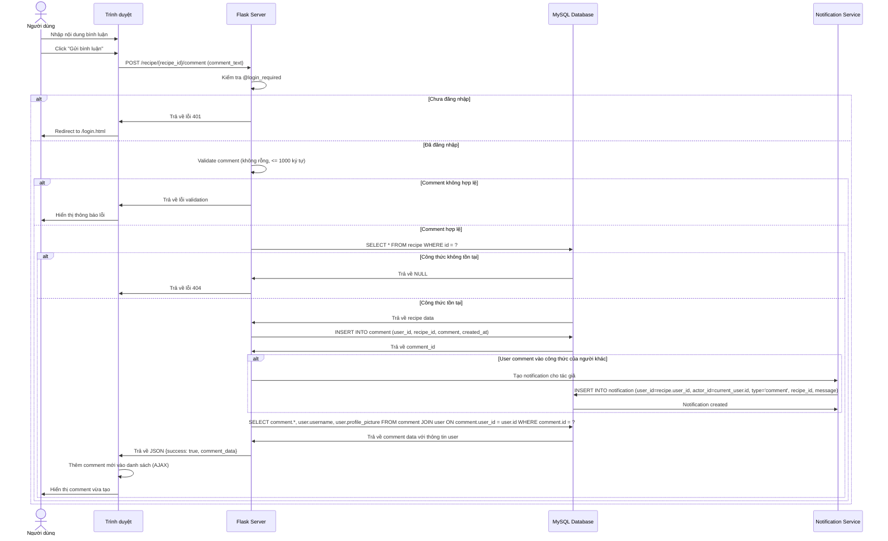
```mermaid
sequenceDiagram
    actor User as Người dùng
    participant Browser as Trình duyệt
    participant Flask as Flask Server
    participant DB as MySQL Database
    participant NotifService as Notification Service
    
    User->>Browser: Nhập nội dung bình luận
    User->>Browser: Click "Gửi bình luận"
    Browser->>Flask: POST /recipe/{recipe_id}/comment (comment_text)
    
    Flask->>Flask: Kiểm tra @login_required
    
    alt Chưa đăng nhập
        Flask->>Browser: Trả về lỗi 401
        Browser->>User: Redirect to /login.html
    else Đã đăng nhập
        Flask->>Flask: Validate comment (không rỗng, <= 1000 ký tự)
        
        alt Comment không hợp lệ
            Flask->>Browser: Trả về lỗi validation
            Browser->>User: Hiển thị thông báo lỗi
        else Comment hợp lệ
            Flask->>DB: SELECT * FROM recipe WHERE id = ?
            
            alt Công thức không tồn tại
                DB->>Flask: Trả về NULL
                Flask->>Browser: Trả về lỗi 404
            else Công thức tồn tại
                DB->>Flask: Trả về recipe data
                
                Flask->>DB: INSERT INTO comment (user_id, recipe_id, comment, created_at)
                DB->>Flask: Trả về comment_id
                
                alt User comment vào công thức của người khác
                    Flask->>NotifService: Tạo notification cho tác giả
                    NotifService->>DB: INSERT INTO notification (user_id=recipe.user_id, actor_id=current_user.id, type='comment', recipe_id, message)
                    DB->>NotifService: Notification created
                end
                
                Flask->>DB: SELECT comment.*, user.username, user.profile_picture FROM comment JOIN user ON comment.user_id = user.id WHERE comment.id = ?
                DB->>Flask: Trả về comment data với thông tin user
                
                Flask->>Browser: Trả về JSON {success: true, comment_data}
                Browser->>Browser: Thêm comment mới vào danh sách (AJAX)
                Browser->>User: Hiển thị comment vừa tạo
            end
        end
    end
```

**Các thành phần liên quan**:
- **Route**: `POST /recipe/{recipe_id}/comment`
- **Models**: `Comment`, `Recipe`, `User`, `Notification`
- **Database Tables**: `comment`, `recipe`, `user`, `notification`

---

## 7. Luồng Yêu thích Công thức

**Mô tả**: Người dùng thêm/bỏ công thức khỏi danh sách yêu thích.

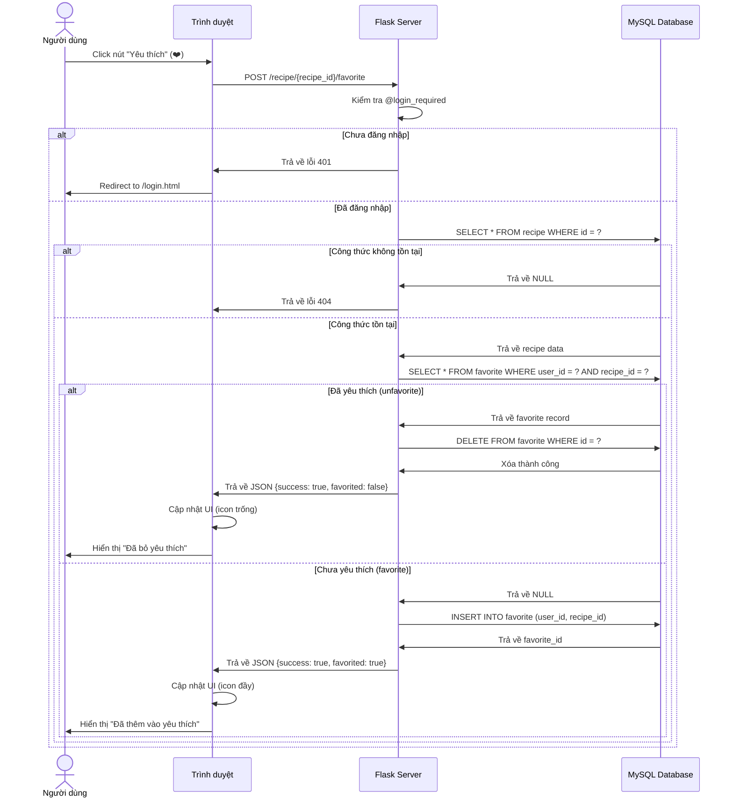
```mermaid
sequenceDiagram
    actor User as Người dùng
    participant Browser as Trình duyệt
    participant Flask as Flask Server
    participant DB as MySQL Database
    
    User->>Browser: Click nút "Yêu thích" (❤️)
    Browser->>Flask: POST /recipe/{recipe_id}/favorite
    
    Flask->>Flask: Kiểm tra @login_required
    
    alt Chưa đăng nhập
        Flask->>Browser: Trả về lỗi 401
        Browser->>User: Redirect to /login.html
    else Đã đăng nhập
        Flask->>DB: SELECT * FROM recipe WHERE id = ?
        
        alt Công thức không tồn tại
            DB->>Flask: Trả về NULL
            Flask->>Browser: Trả về lỗi 404
        else Công thức tồn tại
            DB->>Flask: Trả về recipe data
            
            Flask->>DB: SELECT * FROM favorite WHERE user_id = ? AND recipe_id = ?
            
            alt Đã yêu thích (unfavorite)
                DB->>Flask: Trả về favorite record
                Flask->>DB: DELETE FROM favorite WHERE id = ?
                DB->>Flask: Xóa thành công
                Flask->>Browser: Trả về JSON {success: true, favorited: false}
                Browser->>Browser: Cập nhật UI (icon trống)
                Browser->>User: Hiển thị "Đã bỏ yêu thích"
            else Chưa yêu thích (favorite)
                DB->>Flask: Trả về NULL
                Flask->>DB: INSERT INTO favorite (user_id, recipe_id)
                DB->>Flask: Trả về favorite_id
                Flask->>Browser: Trả về JSON {success: true, favorited: true}
                Browser->>Browser: Cập nhật UI (icon đầy)
                Browser->>User: Hiển thị "Đã thêm vào yêu thích"
            end
        end
    end
```

**Các thành phần liên quan**:
- **Route**: `POST /recipe/{recipe_id}/favorite`
- **Models**: `Favorite`, `Recipe`
- **Database Tables**: `favorite`, `recipe`

---

## 8. Luồng Theo dõi Người dùng

**Mô tả**: Người dùng theo dõi/bỏ theo dõi người dùng khác.

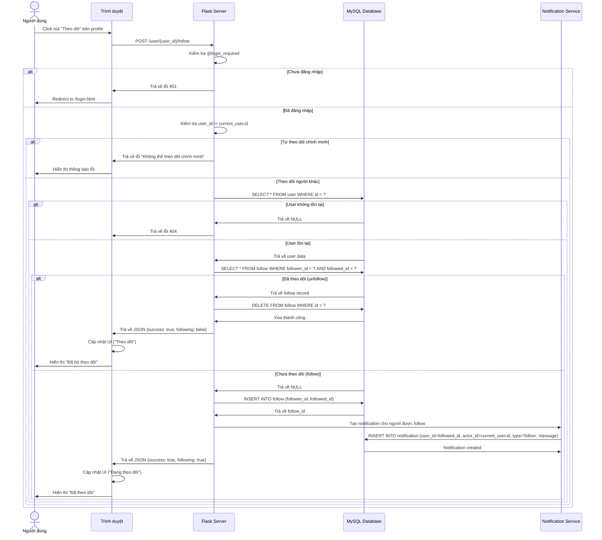
```mermaid
sequenceDiagram
    actor User as Người dùng
    participant Browser as Trình duyệt
    participant Flask as Flask Server
    participant DB as MySQL Database
    participant NotifService as Notification Service
    
    User->>Browser: Click nút "Theo dõi" trên profile
    Browser->>Flask: POST /user/{user_id}/follow
    
    Flask->>Flask: Kiểm tra @login_required
    
    alt Chưa đăng nhập
        Flask->>Browser: Trả về lỗi 401
        Browser->>User: Redirect to /login.html
    else Đã đăng nhập
        Flask->>Flask: Kiểm tra user_id != current_user.id
        
        alt Tự theo dõi chính mình
            Flask->>Browser: Trả về lỗi "Không thể theo dõi chính mình"
            Browser->>User: Hiển thị thông báo lỗi
        else Theo dõi người khác
            Flask->>DB: SELECT * FROM user WHERE id = ?
            
            alt User không tồn tại
                DB->>Flask: Trả về NULL
                Flask->>Browser: Trả về lỗi 404
            else User tồn tại
                DB->>Flask: Trả về user data
                
                Flask->>DB: SELECT * FROM follow WHERE follower_id = ? AND followed_id = ?
                
                alt Đã theo dõi (unfollow)
                    DB->>Flask: Trả về follow record
                    Flask->>DB: DELETE FROM follow WHERE id = ?
                    DB->>Flask: Xóa thành công
                    Flask->>Browser: Trả về JSON {success: true, following: false}
                    Browser->>Browser: Cập nhật UI ("Theo dõi")
                    Browser->>User: Hiển thị "Đã bỏ theo dõi"
                else Chưa theo dõi (follow)
                    DB->>Flask: Trả về NULL
                    Flask->>DB: INSERT INTO follow (follower_id, followed_id)
                    DB->>Flask: Trả về follow_id
                    
                    Flask->>NotifService: Tạo notification cho người được follow
                    NotifService->>DB: INSERT INTO notification (user_id=followed_id, actor_id=current_user.id, type='follow', message)
                    DB->>NotifService: Notification created
                    
                    Flask->>Browser: Trả về JSON {success: true, following: true}
                    Browser->>Browser: Cập nhật UI ("Đang theo dõi")
                    Browser->>User: Hiển thị "Đã theo dõi"
                end
            end
        end
    end
```

**Các thành phần liên quan**:
- **Route**: `POST /user/{user_id}/follow`
- **Models**: `Follow`, `User`, `Notification`
- **Database Tables**: `follow`, `user`, `notification`

---

## 9. Luồng Xem Thông báo

**Mô tả**: Người dùng xem danh sách thông báo của mình.

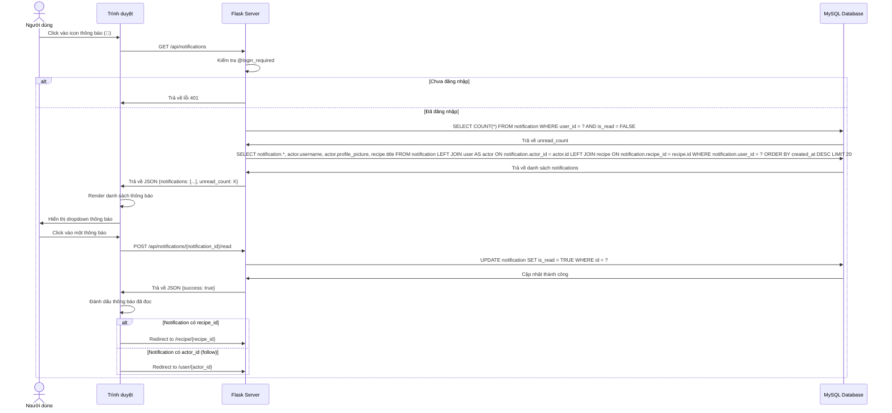
```mermaid
sequenceDiagram
    actor User as Người dùng
    participant Browser as Trình duyệt
    participant Flask as Flask Server
    participant DB as MySQL Database
    
    User->>Browser: Click vào icon thông báo (🔔)
    Browser->>Flask: GET /api/notifications
    
    Flask->>Flask: Kiểm tra @login_required
    
    alt Chưa đăng nhập
        Flask->>Browser: Trả về lỗi 401
    else Đã đăng nhập
        Flask->>DB: SELECT COUNT(*) FROM notification WHERE user_id = ? AND is_read = FALSE
        DB->>Flask: Trả về unread_count
        
        Flask->>DB: SELECT notification.*, actor.username, actor.profile_picture, recipe.title FROM notification LEFT JOIN user AS actor ON notification.actor_id = actor.id LEFT JOIN recipe ON notification.recipe_id = recipe.id WHERE notification.user_id = ? ORDER BY created_at DESC LIMIT 20
        DB->>Flask: Trả về danh sách notifications
        
        Flask->>Browser: Trả về JSON {notifications: [...], unread_count: X}
        Browser->>Browser: Render danh sách thông báo
        Browser->>User: Hiển thị dropdown thông báo
        
        User->>Browser: Click vào một thông báo
        Browser->>Flask: POST /api/notifications/{notification_id}/read
        
        Flask->>DB: UPDATE notification SET is_read = TRUE WHERE id = ?
        DB->>Flask: Cập nhật thành công
        
        Flask->>Browser: Trả về JSON {success: true}
        Browser->>Browser: Đánh dấu thông báo đã đọc
        
        alt Notification có recipe_id
            Browser->>Flask: Redirect to /recipe/{recipe_id}
        else Notification có actor_id (follow)
            Browser->>Flask: Redirect to /user/{actor_id}
        end
    end
```

**Các thành phần liên quan**:
- **Route**: `GET /api/notifications`, `POST /api/notifications/{notification_id}/read`
- **Models**: `Notification`, `User`, `Recipe`
- **Database Tables**: `notification`, `user`, `recipe`

---

## 10. Luồng Admin Phê duyệt Công thức

**Mô tả**: Admin xem và phê duyệt/từ chối công thức đang chờ.

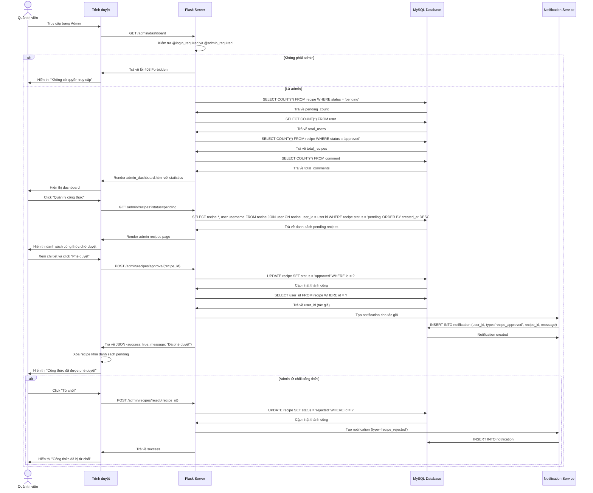
```mermaid
sequenceDiagram
    actor Admin as Quản trị viên
    participant Browser as Trình duyệt
    participant Flask as Flask Server
    participant DB as MySQL Database
    participant NotifService as Notification Service
    
    Admin->>Browser: Truy cập trang Admin
    Browser->>Flask: GET /admin/dashboard
    
    Flask->>Flask: Kiểm tra @login_required và @admin_required
    
    alt Không phải admin
        Flask->>Browser: Trả về lỗi 403 Forbidden
        Browser->>Admin: Hiển thị "Không có quyền truy cập"
    else Là admin
        Flask->>DB: SELECT COUNT(*) FROM recipe WHERE status = 'pending'
        DB->>Flask: Trả về pending_count
        
        Flask->>DB: SELECT COUNT(*) FROM user
        DB->>Flask: Trả về total_users
        
        Flask->>DB: SELECT COUNT(*) FROM recipe WHERE status = 'approved'
        DB->>Flask: Trả về total_recipes
        
        Flask->>DB: SELECT COUNT(*) FROM comment
        DB->>Flask: Trả về total_comments
        
        Flask->>Browser: Render admin_dashboard.html với statistics
        Browser->>Admin: Hiển thị dashboard
        
        Admin->>Browser: Click "Quản lý công thức"
        Browser->>Flask: GET /admin/recipes?status=pending
        
        Flask->>DB: SELECT recipe.*, user.username FROM recipe JOIN user ON recipe.user_id = user.id WHERE recipe.status = 'pending' ORDER BY created_at DESC
        DB->>Flask: Trả về danh sách pending recipes
        
        Flask->>Browser: Render admin recipes page
        Browser->>Admin: Hiển thị danh sách công thức chờ duyệt
        
        Admin->>Browser: Xem chi tiết và click "Phê duyệt"
        Browser->>Flask: POST /admin/recipes/approve/{recipe_id}
        
        Flask->>DB: UPDATE recipe SET status = 'approved' WHERE id = ?
        DB->>Flask: Cập nhật thành công
        
        Flask->>DB: SELECT user_id FROM recipe WHERE id = ?
        DB->>Flask: Trả về user_id (tác giả)
        
        Flask->>NotifService: Tạo notification cho tác giả
        NotifService->>DB: INSERT INTO notification (user_id, type='recipe_approved', recipe_id, message)
        DB->>NotifService: Notification created
        
        Flask->>Browser: Trả về JSON {success: true, message: "Đã phê duyệt"}
        Browser->>Browser: Xóa recipe khỏi danh sách pending
        Browser->>Admin: Hiển thị "Công thức đã được phê duyệt"
        
        alt Admin từ chối công thức
            Admin->>Browser: Click "Từ chối"
            Browser->>Flask: POST /admin/recipes/reject/{recipe_id}
            Flask->>DB: UPDATE recipe SET status = 'rejected' WHERE id = ?
            DB->>Flask: Cập nhật thành công
            Flask->>NotifService: Tạo notification (type='recipe_rejected')
            NotifService->>DB: INSERT INTO notification
            Flask->>Browser: Trả về success
            Browser->>Admin: Hiển thị "Công thức đã bị từ chối"
        end
    end
```

**Các thành phần liên quan**:
- **Route**: `GET /admin/dashboard`, `GET /admin/recipes`, `POST /admin/recipes/approve/{recipe_id}`
- **Models**: `Recipe`, `User`, `Notification`
- **Database Tables**: `recipe`, `user`, `notification`
- **Decorators**: `@admin_required`

---

## 11. Luồng Cập nhật Hồ sơ Người dùng

**Mô tả**: Người dùng cập nhật thông tin cá nhân và ảnh đại diện.

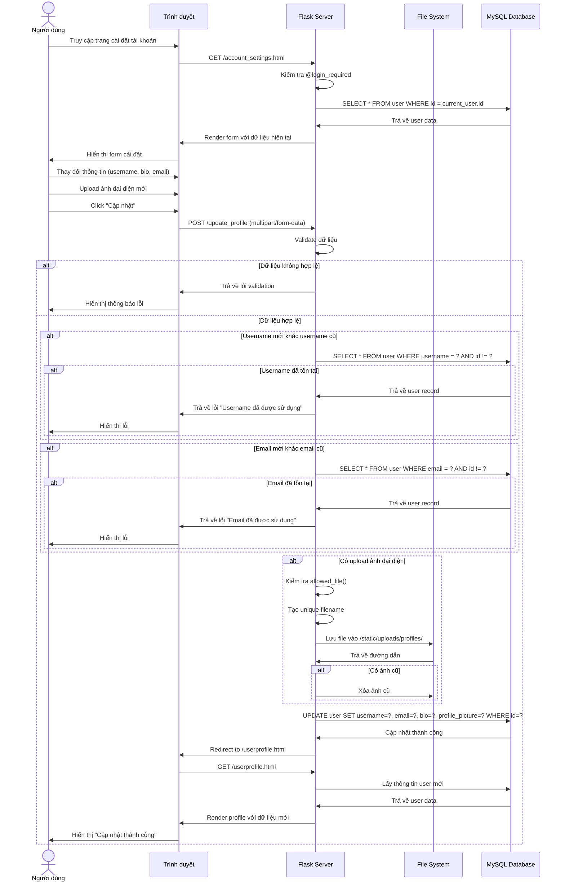
```mermaid
sequenceDiagram
    actor User as Người dùng
    participant Browser as Trình duyệt
    participant Flask as Flask Server
    participant FileSystem as File System
    participant DB as MySQL Database
    
    User->>Browser: Truy cập trang cài đặt tài khoản
    Browser->>Flask: GET /account_settings.html
    
    Flask->>Flask: Kiểm tra @login_required
    Flask->>DB: SELECT * FROM user WHERE id = current_user.id
    DB->>Flask: Trả về user data
    Flask->>Browser: Render form với dữ liệu hiện tại
    Browser->>User: Hiển thị form cài đặt
    
    User->>Browser: Thay đổi thông tin (username, bio, email)
    User->>Browser: Upload ảnh đại diện mới
    User->>Browser: Click "Cập nhật"
    
    Browser->>Flask: POST /update_profile (multipart/form-data)
    
    Flask->>Flask: Validate dữ liệu
    
    alt Dữ liệu không hợp lệ
        Flask->>Browser: Trả về lỗi validation
        Browser->>User: Hiển thị thông báo lỗi
    else Dữ liệu hợp lệ
        alt Username mới khác username cũ
            Flask->>DB: SELECT * FROM user WHERE username = ? AND id != ?
            alt Username đã tồn tại
                DB->>Flask: Trả về user record
                Flask->>Browser: Trả về lỗi "Username đã được sử dụng"
                Browser->>User: Hiển thị lỗi
            end
        end
        
        alt Email mới khác email cũ
            Flask->>DB: SELECT * FROM user WHERE email = ? AND id != ?
            alt Email đã tồn tại
                DB->>Flask: Trả về user record
                Flask->>Browser: Trả về lỗi "Email đã được sử dụng"
                Browser->>User: Hiển thị lỗi
            end
        end
        
        alt Có upload ảnh đại diện
            Flask->>Flask: Kiểm tra allowed_file()
            Flask->>Flask: Tạo unique filename
            Flask->>FileSystem: Lưu file vào /static/uploads/profiles/
            FileSystem->>Flask: Trả về đường dẫn
            
            alt Có ảnh cũ
                Flask->>FileSystem: Xóa ảnh cũ
            end
        end
        
        Flask->>DB: UPDATE user SET username=?, email=?, bio=?, profile_picture=? WHERE id=?
        DB->>Flask: Cập nhật thành công
        
        Flask->>Browser: Redirect to /userprofile.html
        Browser->>Flask: GET /userprofile.html
        Flask->>DB: Lấy thông tin user mới
        DB->>Flask: Trả về user data
        Flask->>Browser: Render profile với dữ liệu mới
        Browser->>User: Hiển thị "Cập nhật thành công"
    end
```

**Các thành phần liên quan**:
- **Route**: `GET /account_settings.html`, `POST /update_profile`
- **Models**: `User`
- **Database Tables**: `user`
- **File Upload**: Profile picture upload

---

## 12. Luồng Tìm kiếm và Lọc Công thức

**Mô tả**: Người dùng tìm kiếm và lọc công thức theo nhiều tiêu chí.

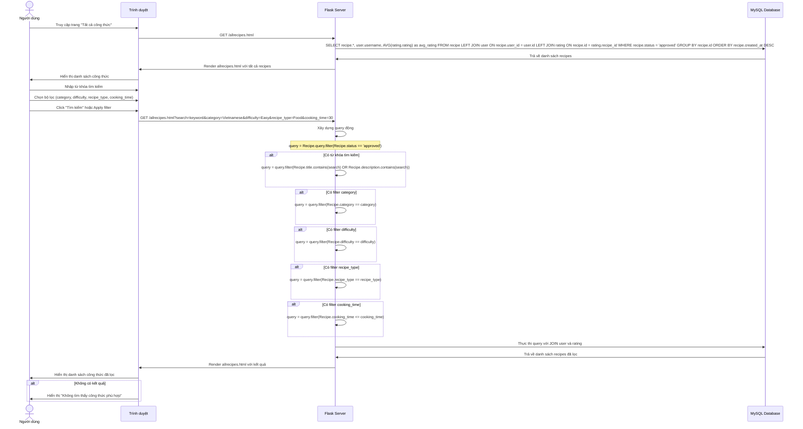
```mermaid
sequenceDiagram
    actor User as Người dùng
    participant Browser as Trình duyệt
    participant Flask as Flask Server
    participant DB as MySQL Database
    
    User->>Browser: Truy cập trang "Tất cả công thức"
    Browser->>Flask: GET /allrecipes.html
    
    Flask->>DB: SELECT recipe.*, user.username, AVG(rating.rating) as avg_rating FROM recipe LEFT JOIN user ON recipe.user_id = user.id LEFT JOIN rating ON recipe.id = rating.recipe_id WHERE recipe.status = 'approved' GROUP BY recipe.id ORDER BY recipe.created_at DESC
    DB->>Flask: Trả về danh sách recipes
    
    Flask->>Browser: Render allrecipes.html với tất cả recipes
    Browser->>User: Hiển thị danh sách công thức
    
    User->>Browser: Nhập từ khóa tìm kiếm
    User->>Browser: Chọn bộ lọc (category, difficulty, recipe_type, cooking_time)
    User->>Browser: Click "Tìm kiếm" hoặc Apply filter
    
    Browser->>Flask: GET /allrecipes.html?search=keyword&category=Vietnamese&difficulty=Easy&recipe_type=Food&cooking_time=30
    
    Flask->>Flask: Xây dựng query động
    Note over Flask: query = Recipe.query.filter(Recipe.status == 'approved')
    
    alt Có từ khóa tìm kiếm
        Flask->>Flask: query = query.filter(Recipe.title.contains(search) OR Recipe.description.contains(search))
    end
    
    alt Có filter category
        Flask->>Flask: query = query.filter(Recipe.category == category)
    end
    
    alt Có filter difficulty
        Flask->>Flask: query = query.filter(Recipe.difficulty == difficulty)
    end
    
    alt Có filter recipe_type
        Flask->>Flask: query = query.filter(Recipe.recipe_type == recipe_type)
    end
    
    alt Có filter cooking_time
        Flask->>Flask: query = query.filter(Recipe.cooking_time <= cooking_time)
    end
    
    Flask->>DB: Thực thi query với JOIN user và rating
    DB->>Flask: Trả về danh sách recipes đã lọc
    
    Flask->>Browser: Render allrecipes.html với kết quả
    Browser->>User: Hiển thị danh sách công thức đã lọc
    
    alt Không có kết quả
        Browser->>User: Hiển thị "Không tìm thấy công thức phù hợp"
    end
```

**Các thành phần liên quan**:
- **Route**: `GET /allrecipes.html`
- **Models**: `Recipe`, `User`, `Rating`
- **Database Tables**: `recipe`, `user`, `rating`
- **Query Parameters**: `search`, `category`, `difficulty`, `recipe_type`, `cooking_time`

---

## 📊 Tổng quan Database Schema

### Các bảng chính và mối quan hệ:

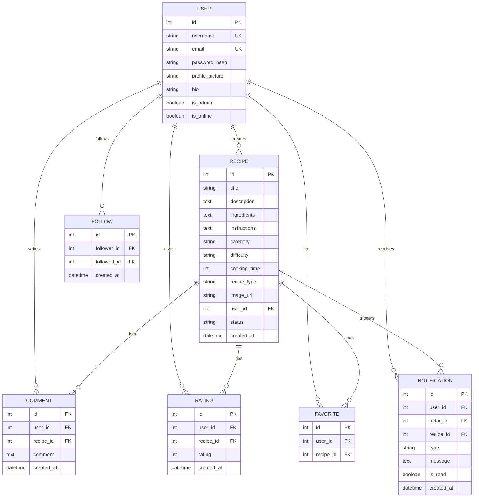
```mermaid
erDiagram
    USER ||--o{ RECIPE : creates
    USER ||--o{ COMMENT : writes
    USER ||--o{ RATING : gives
    USER ||--o{ FAVORITE : has
    USER ||--o{ FOLLOW : follows
    USER ||--o{ NOTIFICATION : receives
    
    RECIPE ||--o{ COMMENT : has
    RECIPE ||--o{ RATING : has
    RECIPE ||--o{ FAVORITE : has
    RECIPE ||--o{ NOTIFICATION : triggers
    
    USER {
        int id PK
        string username UK
        string email UK
        string password_hash
        string profile_picture
        string bio
        boolean is_admin
        boolean is_online
    }
    
    RECIPE {
        int id PK
        string title
        text description
        text ingredients
        text instructions
        string category
        string difficulty
        int cooking_time
        string recipe_type
        string image_url
        int user_id FK
        string status
        datetime created_at
    }
    
    COMMENT {
        int id PK
        int user_id FK
        int recipe_id FK
        text comment
        datetime created_at
    }
    
    RATING {
        int id PK
        int user_id FK
        int recipe_id FK
        int rating
        datetime created_at
    }
    
    FAVORITE {
        int id PK
        int user_id FK
        int recipe_id FK
    }
    
    FOLLOW {
        int id PK
        int follower_id FK
        int followed_id FK
        datetime created_at
    }
    
    NOTIFICATION {
        int id PK
        int user_id FK
        int actor_id FK
        int recipe_id FK
        string type
        text message
        boolean is_read
        datetime created_at
    }
```

---

## 🔐 Authentication Flow

### Cơ chế xác thực và phân quyền:

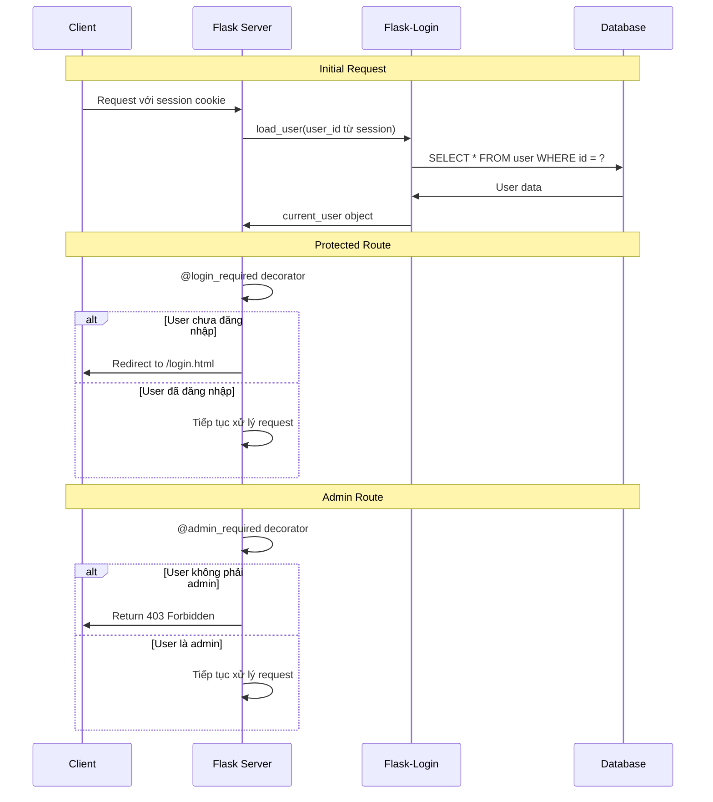
```mermaid
sequenceDiagram
    participant Client as Client
    participant Flask as Flask Server
    participant LoginManager as Flask-Login
    participant DB as Database
    
    Note over Client,DB: Initial Request
    Client->>Flask: Request với session cookie
    Flask->>LoginManager: load_user(user_id từ session)
    LoginManager->>DB: SELECT * FROM user WHERE id = ?
    DB->>LoginManager: User data
    LoginManager->>Flask: current_user object
    
    Note over Client,DB: Protected Route
    Flask->>Flask: @login_required decorator
    alt User chưa đăng nhập
        Flask->>Client: Redirect to /login.html
    else User đã đăng nhập
        Flask->>Flask: Tiếp tục xử lý request
    end
    
    Note over Client,DB: Admin Route
    Flask->>Flask: @admin_required decorator
    alt User không phải admin
        Flask->>Client: Return 403 Forbidden
    else User là admin
        Flask->>Flask: Tiếp tục xử lý request
    end
```

---

## 📝 Ghi chú kỹ thuật

### 1. **Session Management**
- Sử dụng Flask-Login để quản lý session
- Session được lưu trong cookie với SECRET_KEY
- `current_user` được load tự động cho mọi request

### 2. **File Upload**
- Sử dụng Werkzeug `secure_filename()` để bảo mật
- Tạo UUID unique cho mỗi file
- Lưu trữ trong `/static/uploads/profiles/` và `/static/uploads/recipes/`
- Giới hạn: 16MB, extensions: png, jpg, jpeg, gif, webp

### 3. **Password Security**
- Hash password với Werkzeug `generate_password_hash()`
- Verify với `check_password_hash()`
- Không bao giờ lưu plain text password

### 4. **Notification System**
- Tạo notification cho các sự kiện:
  - `follow`: Khi được theo dõi
  - `comment`: Khi có comment mới
  - `rating`: Khi có đánh giá mới
  - `recipe_approved`: Khi công thức được duyệt
  - `recipe_rejected`: Khi công thức bị từ chối
- Real-time update với AJAX polling

### 5. **Database Queries**
- Sử dụng SQLAlchemy ORM
- JOIN tables để giảm số lượng queries
- Eager loading với `db.relationship()`
- Pagination cho danh sách lớn

### 6. **Status Flow của Recipe**
```
pending → approved (bởi admin)
pending → rejected (bởi admin)
```

### 7. **API Endpoints**
- RESTful design
- JSON response cho AJAX requests
- HTTP status codes: 200 (OK), 401 (Unauthorized), 403 (Forbidden), 404 (Not Found)

---

## 🎯 Kết luận

Tài liệu này cung cấp **12 UML Sequence Diagrams** chi tiết cho tất cả các luồng nghiệp vụ chính trong hệ thống FlavorVerse CookBook Platform:

✅ **Authentication**: Đăng ký, Đăng nhập  
✅ **Recipe Management**: Tạo, Xem, Sửa, Xóa công thức  
✅ **Social Features**: Follow, Favorite, Comment, Rating  
✅ **Notification System**: Real-time notifications  
✅ **Admin Functions**: Phê duyệt công thức, Quản lý users  
✅ **User Profile**: Cập nhật thông tin, Upload avatar  
✅ **Search & Filter**: Tìm kiếm và lọc công thức  

Mỗi diagram đều bao gồm:
- Các actors và participants
- Luồng tương tác chi tiết
- Xử lý lỗi (error handling)
- Database operations
- Notification triggers
- Authentication checks

---

**Tác giả**: Team CookBookG5  
**Ngày cập nhật**: 2025-12-06  
**Phiên bản**: 1.0
