# UML Sequence Diagrams - FlavorVerse CookBook Platform

> **Project**: FlavorVerse - Recipe Sharing Platform  
> **Created**: 2025-12-06  
> **Description**: This document contains detailed UML Sequence Diagrams for all major business flows in the CookBookG5 system.

---

## 📑 Table of Contents

1. [User Registration Flow](#1-user-registration-flow)
2. [User Login Flow](#2-user-login-flow)
3. [Create Recipe Flow](#3-create-recipe-flow)
4. [View Recipe Details Flow](#4-view-recipe-details-flow)
5. [Rate Recipe Flow](#5-rate-recipe-flow)
6. [Comment on Recipe Flow](#6-comment-on-recipe-flow)
7. [Favorite Recipe Flow](#7-favorite-recipe-flow)
8. [Follow User Flow](#8-follow-user-flow)
9. [View Notifications Flow](#9-view-notifications-flow)
10. [Admin Approve Recipe Flow](#10-admin-approve-recipe-flow)
11. [Update User Profile Flow](#11-update-user-profile-flow)
12. [Search and Filter Recipes Flow](#12-search-and-filter-recipes-flow)

---

## 1. User Registration Flow

**Description**: New user registers an account on the system.


**Related Components**:
- **Route**: `POST /register`
- **Models**: `User`
- **Database Tables**: `user`
- **Authentication**: Flask-Login, Werkzeug password hashing

---

## 2. User Login Flow

**Description**: Existing user logs into the system.


**Related Components**:
- **Route**: `POST /login`, `GET /home.html`
- **Models**: `User`
- **Database Tables**: `user`
- **Authentication**: Flask-Login (login_user, UserMixin)

---

## 3. Create Recipe Flow

**Description**: Logged-in user creates a new recipe.


**Related Components**:
- **Route**: `GET /create-recipe.html`, `POST /create-recipe`
- **Models**: `Recipe`, `User`, `Notification`
- **Database Tables**: `recipe`, `notification`, `follow`
- **File Upload**: Werkzeug secure_filename, UUID

---

## 4. View Recipe Details Flow

**Description**: User views detailed information of a recipe.


**Related Components**:
- **Route**: `GET /recipe/{recipe_id}`
- **Models**: `Recipe`, `User`, `Rating`, `Comment`, `Favorite`, `Follow`
- **Database Tables**: `recipe`, `user`, `rating`, `comment`, `favorite`, `follow`

---

## 5. Rate Recipe Flow

**Description**: User rates a recipe (1-5 stars).


**Related Components**:
- **Route**: `POST /recipe/{recipe_id}/rate`
- **Models**: `Rating`, `Recipe`, `Notification`
- **Database Tables**: `rating`, `recipe`, `notification`

---

## 6. Comment on Recipe Flow

**Description**: User writes a comment on a recipe.


**Related Components**:
- **Route**: `POST /recipe/{recipe_id}/comment`
- **Models**: `Comment`, `Recipe`, `User`, `Notification`
- **Database Tables**: `comment`, `recipe`, `user`, `notification`

---

## 7. Favorite Recipe Flow

**Description**: User adds/removes recipe from favorites list.

```mermaid
sequenceDiagram
    actor User as User
    participant Browser as Browser
    participant Flask as Flask Server
    participant DB as MySQL Database
    
    User->>Browser: Click "Favorite" button (❤️)
    Browser->>Flask: POST /recipe/{recipe_id}/favorite
    
    Flask->>Flask: Check @login_required
    
    alt Not logged in
        Flask->>Browser: Return 401 error
        Browser->>User: Redirect to /login.html
    else Logged in
        Flask->>DB: SELECT * FROM recipe WHERE id = ?
        
        alt Recipe does not exist
            DB->>Flask: Return NULL
            Flask->>Browser: Return 404 error
        else Recipe exists
            DB->>Flask: Return recipe data
            
            Flask->>DB: SELECT * FROM favorite WHERE user_id = ? AND recipe_id = ?
            
            alt Already favorited (unfavorite)
                DB->>Flask: Return favorite record
                Flask->>DB: DELETE FROM favorite WHERE id = ?
                DB->>Flask: Delete successful
                Flask->>Browser: Return JSON {success: true, favorited: false}
                Browser->>Browser: Update UI (empty icon)
                Browser->>User: Display "Removed from favorites"
            else Not favorited (favorite)
                DB->>Flask: Return NULL
                Flask->>DB: INSERT INTO favorite (user_id, recipe_id)
                DB->>Flask: Return favorite_id
                Flask->>Browser: Return JSON {success: true, favorited: true}
                Browser->>Browser: Update UI (filled icon)
                Browser->>User: Display "Added to favorites"
            end
        end
    end
```



**Related Components**:
- **Route**: `POST /recipe/{recipe_id}/favorite`
- **Models**: `Favorite`, `Recipe`
- **Database Tables**: `favorite`, `recipe`

---

## 8. Follow User Flow

**Description**: User follows/unfollows another user.


**Related Components**:
- **Route**: `POST /user/{user_id}/follow`
- **Models**: `Follow`, `User`, `Notification`
- **Database Tables**: `follow`, `user`, `notification`

---

## 9. View Notifications Flow

**Description**: User views their notification list.

```mermaid
sequenceDiagram
    actor User as User
    participant Browser as Browser
    participant Flask as Flask Server
    participant DB as MySQL Database
    
    User->>Browser: Click notification icon (🔔)
    Browser->>Flask: GET /api/notifications
    
    Flask->>Flask: Check @login_required
    
    alt Not logged in
        Flask->>Browser: Return 401 error
    else Logged in
        Flask->>DB: SELECT COUNT(*) FROM notification WHERE user_id = ? AND is_read = FALSE
        DB->>Flask: Return unread_count
        
        Flask->>DB: SELECT notification.*, actor.username, actor.profile_picture, recipe.title FROM notification LEFT JOIN user AS actor ON notification.actor_id = actor.id LEFT JOIN recipe ON notification.recipe_id = recipe.id WHERE notification.user_id = ? ORDER BY created_at DESC LIMIT 20
        DB->>Flask: Return notification list
        
        Flask->>Browser: Return JSON {notifications: [...], unread_count: X}
        Browser->>Browser: Render notification list
        Browser->>User: Display notification dropdown
        
        User->>Browser: Click on a notification
        Browser->>Flask: POST /api/notifications/{notification_id}/read
        
        Flask->>DB: UPDATE notification SET is_read = TRUE WHERE id = ?
        DB->>Flask: Update successful
        
        Flask->>Browser: Return JSON {success: true}
        Browser->>Browser: Mark notification as read
        
        alt Notification has recipe_id
            Browser->>Flask: Redirect to /recipe/{recipe_id}
        else Notification has actor_id (follow)
            Browser->>Flask: Redirect to /user/{actor_id}
        end
    end
```



**Related Components**:
- **Route**: `GET /api/notifications`, `POST /api/notifications/{notification_id}/read`
- **Models**: `Notification`, `User`, `Recipe`
- **Database Tables**: `notification`, `user`, `recipe`

---

## 10. Admin Approve Recipe Flow

**Description**: Admin views and approves/rejects pending recipes.


**Related Components**:
- **Route**: `GET /admin/dashboard`, `GET /admin/recipes`, `POST /admin/recipes/approve/{recipe_id}`
- **Models**: `Recipe`, `User`, `Notification`
- **Database Tables**: `recipe`, `user`, `notification`
- **Decorators**: `@admin_required`

---

## 11. Update User Profile Flow

**Description**: User updates personal information and profile picture.


**Related Components**:
- **Route**: `GET /account_settings.html`, `POST /update_profile`
- **Models**: `User`
- **Database Tables**: `user`
- **File Upload**: Profile picture upload

---

## 12. Search and Filter Recipes Flow

**Description**: User searches and filters recipes by multiple criteria.


**Related Components**:
- **Route**: `GET /allrecipes.html`
- **Models**: `Recipe`, `User`, `Rating`
- **Database Tables**: `recipe`, `user`, `rating`
- **Query Parameters**: `search`, `category`, `difficulty`, `recipe_type`, `cooking_time`

---

## 📊 Database Schema Overview

### Main tables and relationships:


---

## 🔐 Authentication Flow

### Authentication and authorization mechanism:


---

## 📝 Technical Notes

### 1. **Session Management**
- Uses Flask-Login for session management
- Session stored in cookie with SECRET_KEY
- `current_user` automatically loaded for every request

### 2. **File Upload**
- Uses Werkzeug `secure_filename()` for security
- Generates unique UUID for each file
- Stored in `/static/uploads/profiles/` and `/static/uploads/recipes/`
- Limits: 16MB, extensions: png, jpg, jpeg, gif, webp

### 3. **Password Security**
- Hash password with Werkzeug `generate_password_hash()`
- Verify with `check_password_hash()`
- Never store plain text passwords

### 4. **Notification System**
- Creates notifications for events:
  - `follow`: When followed
  - `comment`: When new comment received
  - `rating`: When new rating received
  - `recipe_approved`: When recipe approved
  - `recipe_rejected`: When recipe rejected
- Real-time update with AJAX polling

### 5. **Database Queries**
- Uses SQLAlchemy ORM
- JOIN tables to reduce number of queries
- Eager loading with `db.relationship()`
- Pagination for large lists

### 6. **Recipe Status Flow**
```
pending → approved (by admin)
pending → rejected (by admin)
```

### 7. **API Endpoints**
- RESTful design
- JSON response for AJAX requests
- HTTP status codes: 200 (OK), 401 (Unauthorized), 403 (Forbidden), 404 (Not Found)

---

## 🎯 Conclusion

This document provides **12 detailed UML Sequence Diagrams** for all major business flows in the FlavorVerse CookBook Platform system:

✅ **Authentication**: Registration, Login  
✅ **Recipe Management**: Create, View, Edit, Delete recipes  
✅ **Social Features**: Follow, Favorite, Comment, Rating  
✅ **Notification System**: Real-time notifications  
✅ **Admin Functions**: Approve recipes, Manage users  
✅ **User Profile**: Update information, Upload avatar  
✅ **Search & Filter**: Search and filter recipes  

Each diagram includes:
- Actors and participants
- Detailed interaction flows
- Error handling
- Database operations
- Notification triggers
- Authentication checks

---

**Author**: Team CookBookG5  
**Last Updated**: 2025-12-06  
**Version**: 1.0
